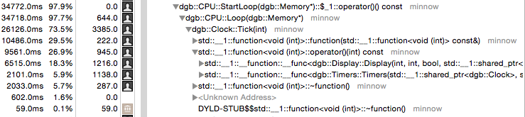
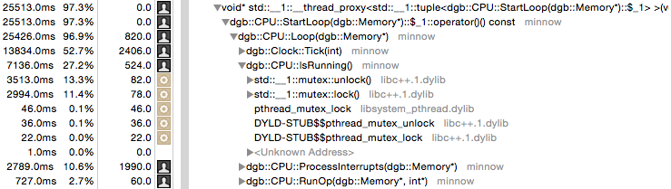

# Interesting Stuff

This file will attempt to accumulate the interesting things that I've found or
discovered throughout the development of the Minnow emulator.

## Interesting Bugs

### Horizontal Flipping Sprites (Super Mario Land)

TODO

### Top Scanline Glitch (Super Mario Land)

At this point, I had the emulator reliably running the first few levels of the
Super Mario Land ROM with one exception: when Mario is walking to the right,
occasionally the top few scanlines will glitch as if they're momentarily
shifting to the left.


Now I already know that Super Mario Land uses mid-frame scanline shifting to
adjust the background scenery (that produced some interesting visuals before I
implemented the LCD coincidence interrupt), so I figured it was a result of the
background scroll x value not being set properly.

I traced the game code that set the scroll x value to two different routines,
ultimately resulting from the LCD STAT interrupt handler (coincidence interrupt
triggered when LCDCY == 15) and the VBLANK interrupt. I decided to check when
the scanline Y=0 was being rendered with Scroll-X != 0, and voila, it
consistently happened within the code that waits for the [DMA transfer
function](http://bgb.bircd.org/pandocs.htm#lcdoamdmatransfers) to complete,
which is in the VBLANK handler (but before Scroll-X is set to 0).

At this point, I noticed that the VBLANK interrupt handler was taking more
cycles to complete than the VBLANK period (4560 cycles), which is why the top
scanline was being moved. Actually, since the top scanline of gameplay is
blank, it's the Y=1 scanline that we care about, but it was still taking long
enough that we would be in Y=1 before the VBLANK handler completed.

It was taking on the order of 10's of cycles longer than the start of the Y=1
scanline. I loaded up my nitty-gritty [GameBoy LCD timing reference](
http://gameboy.mongenel.com/dmg/gbc_lcdc_timing.txt)
and, sure enough, the scanline data transfer doesn't actually start as soon as
the LCD controller reaches the next scanline. There's a brief period in which
the LCD controller searches the OAM table before beginning the data transfer,
and it takes between 77 and 83 cycles to complete. So, I added an 83-cycle
delay before rendering the scanline out to the framebuffer. It _mostly_ removed
the glitch, but it would still happen once in a while.

At this point, I was stumped. I loaded up the Super Mario Land ROM
into a fully working emulator that I'd downloaded from online and tried it.
**The glitch was there**. I figured it was pretty unlikely that we'd both made
the exact same timing mistake, so I dug out my old GameBoy (you know, the
see-through purple GameBoy color that everyone had in the 90's?) and tried it
out. **The glitch was present on the cartridge version on real GameBoy
hardware!**

So, it turns out that the developers of Super Mario Land cartridge were cutting
their VBLANK handler very close to the number of available cycles, and
occasionally would use up too many, causing a small glitch in the top line of
the screen. Since that line was very close to the bezel on the edge of the
screen and most people weren't intently staring at it, they got away with it.

It's pretty amazing the things that game developers did to squeeze more
performance out of hardware on older consoles. It's humbling to think that,
while I sit here struggling to write stuff in C++ for moderm CPUs, they built
that game on a 4 MHz processor with a finicky LCD controller, all without
modern development tools. Hats off to you, Nintendo.

### Impactful Performance Improvements

It's always amazing to me how a very small change in code can result in a massive improvement in performance. Finding low-hanging fruit like these depends pretty heavily on use of the right toolset. Today, I discovered the "Instruments" application built into Mac OSX. It's awesome, you should check it out if you do any development on OSX.

#### std::function copy constructor

I used its Time Profiler (a sampling profiler) to take a look at which functions were taking up more than their fair share of time in the Minnow application. After a very short amount of digging, I came up with one culprit:



You can see in the fourth line above that the constructor for `std::function`, called from within `Clock::Tick`, was taking up 29.5% of the CPU time. This seemed pretty odd to me, so I took a look at the code for `Clock::Tick`, and found this:

```
void Tick(int cycles) {
  for (std::function<void(int)> f : callbacks_) {
    f(cycles);
  }
  ...
}
```

It's iterating through the callbacks_ vector, but it's _copying_ each `std::function` object into a stack variable `f`! Since `std::function` has some magic going on within it, and it stores a decent amount of data, this copy constructor was taking a _very_ long time to run. Not surprisingly, adding a single `&` character had a huge impact on the emulator's performance.

```
void Tick(int cycles) {
  for (std::function<void(int)> &f : callbacks_) {
    f(cycles);
  }
  ...
}
```

It managed to bump Minnow's unthrottled framerate from ~55fps to ~105fps. **Thats a roughly 2x speed improvement with a single character of code.**

#### std::atomic vs. std::mutex

I sat in amazement for a little while, and then dug back in to see if I could find any more low-hanging fruit. To my surprise, another fairly obvious culprit:



You can see that CPU::IsRunning() is now taking up 27.2% of the host CPU's time, with most of it going to locking and unlocking the mutex. Not ideal. After a tiny bit of research, I found out that, while its actual performance is compiler- and architecture- dependent, `std::atomic<bool>` is a hell of a lot faster than `std::mutex`, and is practical for protecting primitives like `bool`'s. So, I swapped the mutex code out for atomics, and voila, another huge speed bump. I'm now seeing 130fps unthrottled framerate in Minnow, which, in my opinion, is pretty good.

#### Moral of the Story

The morla of the story is this: if you have access to one, you should _absolutely_ use a profiler at some point in the development cycle if you care about fast code. They're pretty easy to use, and can point out obvious performance improvements that can sometimes be as simple as adding one character.

I could probably go digging through the timing profile for the next few days, eking out little performance improvements here and there, but for now, I'm pretty stoked with a 55 to 130 fps improvement. There's still lots of other stuff to do.